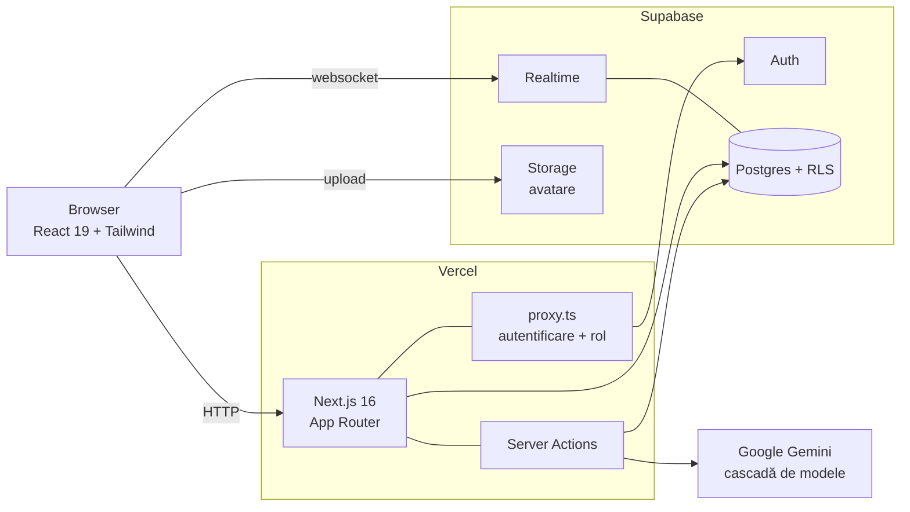
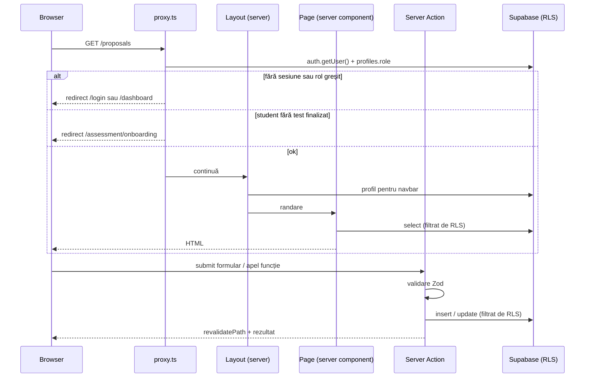
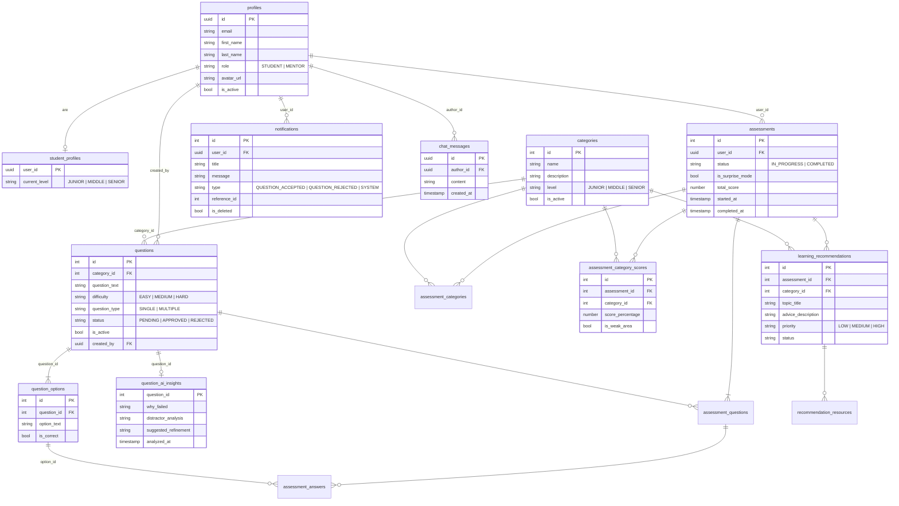
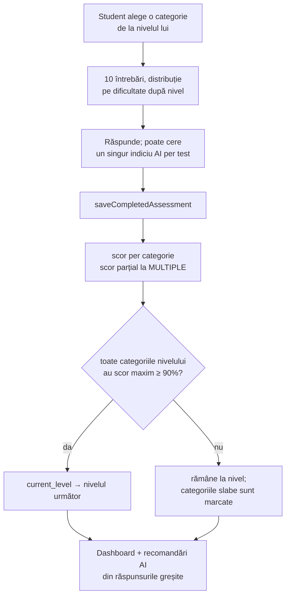

# Arhitectura SkillPath

SkillPath este o platformă de evaluare pentru programatori juniori. Studentul își măsoară nivelul pe categorii prin teste grilă și avansează de la Junior la Middle și Senior. Mentorul întreține categoriile și întrebările, aprobă propunerile studenților și generează întrebări noi cu AI.

Documentul descrie starea actuală a sistemului: componentele, cum circulă o cerere, modelul de date și fluxurile principale. Pentru pornire locală vezi `README.md`.

## 1. Vedere de ansamblu



Trei sisteme externe, un singur serviciu propriu:

| Componentă | Rol | Unde |
|---|---|---|
| Next.js 16 (App Router) | Randare pe server, rute, server actions, control acces | `app/`, `server/`, `proxy.ts` |
| Supabase | Bază de date Postgres cu RLS, autentificare, realtime, storage | proiect Supabase gestionat |
| Google Gemini | Generare de întrebări, indicii, recomandări de învățare, analiză de întrebări | apelat din server actions |
| Vercel | Deploy automat din `main`, preview pe fiecare PR | |

Nu există backend separat. Toată logica de server stă în Next.js: server components pentru citire, server actions pentru scriere.

## 2. Stack

| Strat | Tehnologie |
|---|---|
| UI | React 19, Tailwind CSS 4, `next-themes` pentru dark mode |
| Framework | Next.js 16, App Router, Server Components, Server Actions |
| Validare | Zod 4, la intrarea în fiecare server action |
| Date | Supabase (`@supabase/ssr` pentru sesiuni prin cookie-uri, `@supabase/supabase-js`) |
| AI | `@google/genai` cu output structurat (JSON schema), `groq-sdk` disponibil ca dependență |
| Teste | Vitest + Testing Library (unitar), Vitest pe Supabase real (integrare) |

## 3. Structura codului

```
app/                  rute (App Router)
  (auth)/login        autentificare
  (student)/          dashboard, assessment, propose (layout de student)
  (mentor)/           overview, categories, questions, proposals,
                      students (layout de mentor)
  forum/, settings/   comune ambelor roluri
  api/auth/callback   schimbul de cod după confirmarea emailului
components/           componente React, grupate pe domeniu
server/
  actions/            server actions, un fișier per domeniu
  supabase/           clienți Supabase + servicii de citire
lib/                  logică pură, fără I/O: niveluri, cenzură, navigație
config/               valori configurabile: assessmentConfig, aiConfig
types/                tipuri partajate
supabase/             migrații și politici RLS
unit-tests/           teste unitare, cu Supabase și AI simulate
integration-tests/    teste de integrare, pe un proiect Supabase real
proxy.ts              control acces pe fiecare cerere
```

Regula de separare: `lib/` nu importă nimic din `server/`, `server/supabase/*Service.ts` citește, `server/actions/*` scrie. Componentele client nu ating baza de date direct, cu excepția abonamentelor Realtime și a upload-ului de avatar.

## 4. Cum trece o cerere



**Două straturi de protecție, independente:**

1. `proxy.ts` decide dacă utilizatorul poate ajunge pe rută. Verifică sesiunea, apoi rolul din `profiles`, apoi, pentru studenți, dacă au cel puțin un test finalizat (altfel merg obligatoriu la onboarding).
2. RLS în Postgres decide ce rânduri vede și modifică fiecare utilizator, indiferent de ce face codul. Chiar dacă o pagină ar avea un bug, un student nu poate citi notificările altcuiva sau modifica întrebări.

Header-ul `x-e2e-test: true` sare peste proxy, iar server actions care apelează AI-ul întorc răspunsuri simulate în același caz. Este folosit doar la testare automată.

### Rute și roluri

| Rută | Rol | Ce face |
|---|---|---|
| `/login` | public | login, înregistrare, confirmare email |
| `/dashboard` | student | nivel și progres spre următorul, serie de zile consecutive, istoric scoruri, radar pe categorii, acuratețe pe dificultate, activitate pe 7 zile, insigne, arii de concentrat din recomandările AI |
| `/assessment` | student | lista categoriilor accesibile, blocate sau deblocate |
| `/assessment/onboarding` | student | testul inițial (15 întrebări din toate categoriile de Junior) |
| `/assessment/[id]` | student | test pe o categorie (10 întrebări) |
| `/assessment/surprise` | student | modul surpriză: 10 întrebări amestecate din toate categoriile nivelului |
| `/propose` | student | propune o întrebare nouă |
| `/overview` | mentor | activitate recentă, distribuție pe nivel și pe scoruri, activitate pe 7 zile, întrebările cu cele mai multe greșeli și analiza lor AI |
| `/categories` | mentor | CRUD categorii, cu nivel; filtre după text, status și nivel |
| `/questions` | mentor | CRUD întrebări, activare/dezactivare |
| `/proposals` | mentor | aprobare/respingere propuneri, generare cu AI |
| `/students`, `/students/[id]` | mentor | lista studenților, activare/dezactivare, promovare la mentor; per student: scor pe categorii și istoricul testelor |
| `/forum` | ambele | chat comun, în timp real |
| `/settings` | ambele | nume, parolă, avatar, temă |

## 5. Autentificare și roluri

- Supabase Auth cu email și parolă. Sesiunea stă în cookie-uri, gestionate de `@supabase/ssr`, deci funcționează și în server components, și în proxy.
- La înregistrare utilizatorul își alege rolul (student sau mentor). Clientul creează apoi rândul din `profiles` și, pentru studenți, pe cel din `student_profiles`. Nu există trigger în baza de date pentru asta.
- Confirmarea emailului trece prin `app/api/auth/callback`, care schimbă codul pe sesiune și afișează o pagină care se închide singură.
- Rolul nu e în Auth, ci în tabela `profiles` (`role`: `STUDENT` sau `MENTOR`). Un mentor poate promova un student la mentor din `/students`.
- Nivelul studentului stă separat, în `student_profiles.current_level`.

Doi clienți Supabase, cu roluri diferite:

| Client | Fișier | Folosit în |
|---|---|---|
| server, cu cookie-uri | `server/supabase/server.ts` | proxy, layouts, pages, server actions |
| browser, singleton | `server/supabase/client.ts` | abonamente Realtime, upload avatar, auth pe client |

Ambii folosesc cheia publică. Nu există cheie de serviciu în aplicație, deci tot ce face aplicația trece prin RLS.

## 6. Modelul de date



### Grupuri de tabele

**Conținut** (`categories`, `questions`, `question_options`). O categorie are un nivel. O întrebare are dificultate, tip (un răspuns sau mai multe) și status. Doar întrebările `APPROVED` și `is_active` intră în teste. Propunerile studenților și întrebările generate de AI intră ca `PENDING` și inactive.

**Evaluare** (`assessments`, `assessment_categories`, `assessment_questions`, `assessment_answers`, `assessment_category_scores`). Un test are întrebările sale, în ordine, cu răspunsurile date și scorul per categorie. `is_weak_area` marchează categoriile sub pragul de revizuire. Nivelul se calculează din scorul maxim istoric per categorie, nu din ultimul test.

**Utilizatori** (`profiles`, `student_profiles`, `notifications`). Profilul e comun. Nivelul e doar pentru studenți.

**AI** (`learning_recommendations`, `recommendation_resources`, `question_ai_insights`). Recomandările sunt generate o dată per test și memorate, ca să nu se cheme AI-ul la fiecare vizită. Analiza întrebărilor problematice se salvează per întrebare.

**Comunitate** (`chat_messages`). Forumul e un singur canal comun.

### RLS

RLS e activ pe toate tabelele. Regulile principale:

- `profiles`, `student_profiles`: citire publică, fiecare își modifică doar propriul rând.
- `questions`, `question_options`: mentorii pot modifica și șterge; studenții doar inserează propuneri.
- `notifications`: fiecare își vede doar ale lui, nesterse.
- `chat_messages`: toți citesc, fiecare inserează doar cu propriul `author_id`.

> Notă: `server/supabase/database.types.ts` este în urma bazei de date. Lipsesc `notifications`, `question_ai_insights` și coloana `avatar_url`. Se regenerează cu `npm run gen:types`. Politicile din `supabase/*.sql` nu sunt încă migrații, deci un mediu nou trebuie să le ruleze manual.

## 7. Fluxuri principale

### Onboarding

1. Un student nou se loghează. Proxy-ul vede zero teste finalizate și îl trimite la `/assessment/onboarding`.
2. Pagina ia 15 întrebări din toate categoriile nivelului curent, în distribuția 6 ușoare, 6 medii, 3 grele (`assessmentConfig`).
3. La final, `saveCompletedAssessment` scrie testul, răspunsurile și scorul per categorie.
4. Dacă scorul total e cel puțin 90%, studentul sare direct un nivel (Junior → Middle sau Middle → Senior). Altfel rămâne la nivelul curent și continuă cu testele pe categorii.

### Test pe categorie și level-up



Regula de nivel: eticheta afișată este ultimul nivel trecut. Un student cu `current_level = MIDDLE` primește întrebări de Middle și rămâne Middle până le trece pe toate la 90%. Pragul și distribuțiile sunt în `config/assessmentConfig.ts`, care validează valorile la pornire.

Scorul la întrebările cu mai multe răspunsuri e parțial: fiecare variantă corectă aleasă aduce `1/N`, fiecare greșită scade `1/M`, minim 0 (`assessmentScoring.ts`).

Modul surpriză (`/assessment/surprise`) folosește același flux, dar cu întrebări din toate categoriile nivelului. Se salvează cu `is_surprise_mode = true`, contribuie la scorul per categorie și, deci, la level-up.

Dashboard-ul (`dashboardService.ts`) calculează totul din testele finalizate, la fiecare încărcare: seria de zile consecutive cu teste, media scorurilor și diferența față de luna trecută, radarul pe categorii, acuratețea pe dificultate, activitatea pe 7 zile și patru insigne (primul test, învățare rapidă, perfecționist, master de categorie). Nu există tabelă de insigne; sunt derivate.

### Propunere, aprobare, notificare

1. Studentul trimite o întrebare din `/propose`. Intră `PENDING`, inactivă, cu `created_by` = studentul.
2. Mentorul o vede în `/proposals`, o poate edita, aproba sau respinge.
3. La aprobare devine `APPROVED` + activă și intră în teste. Studentul primește o notificare `QUESTION_ACCEPTED` sau `QUESTION_REJECTED`. Mentorul nu e notificat pentru propriile întrebări.
   Widget-ul de notificări le încarcă la deschiderea paginii și de fiecare dată când fereastra revine în prim-plan; nu folosește Realtime.
4. Pagina de propuneri se reîmprospătează singură la orice schimbare în `questions`, prin Realtime.

### Generare de întrebări cu AI

1. Mentorul alege categorie, tip (un răspuns, mai multe, mixt), dificultate (ușor, mediu, greu, mixt) și număr (1-5).
2. `generateAiQuestions` verifică limita zilnică (10 întrebări per mentor în 24h, `config/aiConfig.ts`), ia întrebările existente din categorie ca să evite duplicatele, și construiește prompt-ul.
3. Gemini răspunde cu JSON conform unei scheme. Fiecare întrebare trece prin Zod: 4 variante, tip consistent cu numărul de răspunsuri corecte. Ce nu trece e ignorat, restul se inserează.
4. Întrebările intră `PENDING`, cu `created_by` = mentorul, și urmează același flux de aprobare. Badge-ul „Generat de AI” și filtrul din pagină se bazează pe faptul că autorul e mentor.

### Forum

Mesajele se scriu prin server action, cu cenzurare de cuvinte (`lib/censor.ts`) la citire. Clientul se abonează la `chat_messages` prin Realtime și primește mesajele noi fără refresh.

## 8. Integrarea cu AI

Toate apelurile trec prin `server/actions/ai-fallback.ts`:

- **Cascadă de modele.** O listă de modele Gemini, încercate pe rând. Un 503 sau timeout trece la următorul. Modelul care a funcționat ultima dată devine primul la următorul apel.
- **Timeout 30s și maximum 2 încercări per model.** Fără asta, SDK-ul reîncerca de 5 ori cu pauze exponențiale și o cerere putea dura minute.
- **Erorile 400 (prompt invalid) nu cad pe următorul model**, se aruncă imediat, pentru că ar eșua la fel peste tot.

Patru utilizări, toate pe server:

| Funcție | Ce face | Output |
|---|---|---|
| `generateAiQuestions` | întrebări noi pe categorie | JSON structurat, validat cu Zod |
| `generateAIRecommendations` | recomandări de învățare după un test | JSON structurat, salvat în DB |
| `getQuickHint` | indiciu în timpul testului | text liber |
| `generateSingleQuestionInsight` | de ce pică o întrebare la mulți studenți | JSON, salvat în `question_ai_insights` |

Cheia API nu ajunge niciodată în browser. În `NODE_ENV=test`, funcțiile întorc răspunsuri simulate.

## 9. Realtime

Două abonamente, ambele pe `postgres_changes`:

| Tabelă | Cine ascultă | Efect |
|---|---|---|
| `questions` | pagina de propuneri a mentorului | `router.refresh()` la orice schimbare |
| `chat_messages` | forum | mesajul nou apare în listă |

Realtime cere ca tabela să fie adăugată la publicația `supabase_realtime`, ceea ce se face în migrația de chat.

## 10. Configurare

| Fișier | Conține |
|---|---|
| `config/assessmentConfig.ts` | număr de întrebări per test și onboarding, distribuția pe dificultăți per nivel, pragul de promovare (90%), pragul de arie slabă (60%) |
| `config/aiConfig.ts` | limita zilnică de generare per mentor, maxim per lot |
| `lib/levels.ts` | lista nivelurilor și ordinea lor |

Variabile de mediu:

| Variabilă | Unde | Scop |
|---|---|---|
| `NEXT_PUBLIC_SUPABASE_URL` | browser + server | URL-ul proiectului |
| `NEXT_PUBLIC_SUPABASE_PUBLISHABLE_KEY` | browser + server | cheia publică, RLS se aplică |
| `GEMINI_API_KEY` | server | apeluri AI |
| `SUPABASE_SERVICE_ROLE_KEY` | doar teste de integrare | curățarea datelor de test, ocolește RLS |
| `TEST_USER_PASSWORD` | doar teste de integrare | parola conturilor `student@test.com` și `mentor@test.com` |

## 11. Testare

| Tip | Unealtă | Ce acoperă | Comandă |
|---|---|---|---|
| Unitar | Vitest + happy-dom | logica de scor și nivel, server actions cu Supabase și AI simulate, componente | `npm test` |
| Integrare | Vitest + Supabase real | server actions cap-coadă pe baza de date: propunere și aprobare, test și scor, dashboard, notificări, chat, acțiuni de mentor | `npm run test:integration` |

Testele unitare nu au nevoie de nimic extern. `npm run test:coverage` generează și raportul de acoperire.

Testele de integrare (`integration-tests/`) rulează server actions reale pe proiectul Supabase din `.env.local`, cu două conturi de test autentificate (student și mentor) și un client cu cheie de serviciu pentru curățarea datelor la final. Fișierele rulează secvențial, ca să nu se calce pe date. `vitest.integration.setup.ts` înlocuiește `createClient` cu clientul rolului activ și dezactivează răspunsurile simulate. Folderele de teste sunt excluse din build (`tsconfig.json`).

## 12. Limitări cunoscute

- **Rolul se alege la înregistrare.** Oricine își poate face cont de mentor. Într-un mediu real, rolul de mentor ar trebui acordat doar de un mentor existent (funcția de promovare există deja în `/students`).
- **Cardurile de categorii blocate sunt scrise în cod**, nu citite din baza de date. Dacă mentorul adaugă o categorie de Middle, studentul Junior nu o vede ca „blocată” până nu se actualizează `assessment/page.tsx`.
- **Onboarding-ul sare un singur nivel.** Un student care ar fi Senior ajunge Middle după onboarding și trebuie să treacă și testele de Middle.
- **Tabela `question_ai_insights` nu are migrație**; a fost creată direct din Supabase.
- **Sursa unei întrebări e dedusă din rolul autorului.** O întrebare `PENDING` scrisă de un mentor e considerată generată de AI. O coloană `source` ar fi explicită.
- **Limita zilnică de generare numără toate întrebările create de mentor**, inclusiv cele scrise manual, pentru că tabela nu deosebește sursa.
- **Politicile RLS nu sunt toate migrații.** `supabase/*.sql` trebuie rulate manual pe un mediu nou.
- **Tipurile generate sunt în urmă** față de schema reală (vezi nota de la secțiunea 6).
- **Indexul modelului AI activ stă în `globalThis`**, deci pe Vercel fiecare instanță își ține propriul index. Funcționează, dar nu e partajat.
- **Realtime pe `questions` reîmprospătează toată pagina** la orice schimbare, inclusiv cele făcute de mentorul curent. Suficient la volumul actual.
